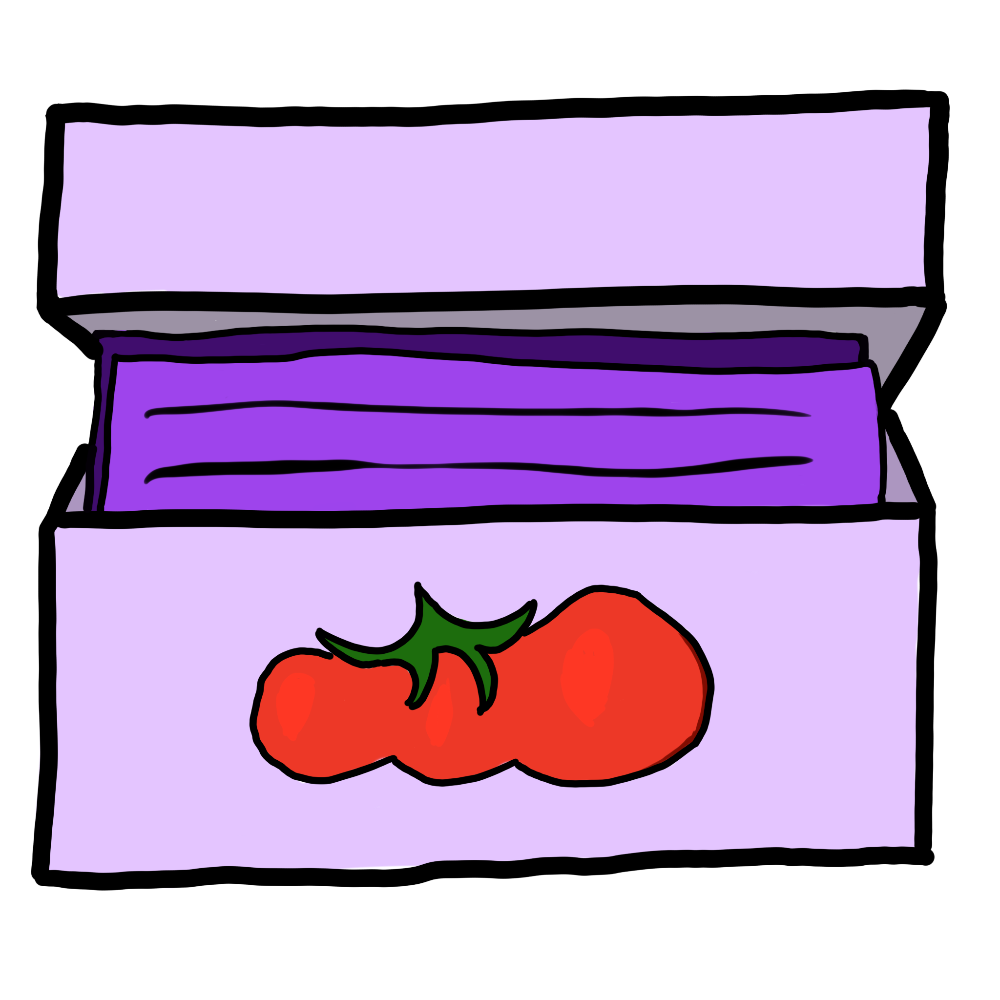

# Recipe Box
Healthier lives through healthier cooking.

## Why?
Food is part of our lives.
Preparing food connects our body to the world around us.
Sharing food weaves social bonds in homes, families and communities.

But sometimes it's hard to figure out what to make.
How much time will it take to prepare?
Is it going to include techniques you're still working on learning?
Do you have the time and energy to do something extravagent, or only simple?
What produce is in season?
How much does the meal cost?
Will the meal support your health and nutrition goals?

When you collect  recipes from around the web into Recipe Box, it suggests a recipe for based upon your available time, energy and nutritional needs.

## How
There are three main workflows for Recipe Box: adding a recipe, choosing a recipe, and sharing the results.

### Adding a Recipe
1. Look for recipes like you normally do on your phone
2. Click your browsers or the apps "Share" button
3. Select Recipe Box!

### Choosing a Recipe

1. Open Recipe Box
2. Add some constrants!
3. Pick a recipe from the suggestions!

### Sharing a Recipe
1. Take a photo (or several!) of your meal.
2. Tap "Share"
3. Send the recipe directly to your friends and family, or publish to social media.

## Get Involved!
At the moment, Recipe Box is a _seed_ stage project.
Most of the work is going to involve reading and thinking and trying things out.
There are several ways to get involved:

1. Follow the #RecipeBox tag on your social media platform of choice.
   This will keep you up to date with the development of Recipe Box.
2. Read and comment on our [open Requests for Comment](https://github.com/zinc-collective/recipe-box/issues?q=is%3Aissue+is%3Aopen+label%3A%22request+for+comment%22)
3. [Open issues](https://github.com/zinc-collective/recipe-box/issues) to clarify questions, request help, report bugs, or provide feedback on our current [design artifacts](./design).
4. Take a stab at some of our tickets that are [good for newcomers](https://github.com/zinc-collective/recipe-box/issues?q=is%3Aissue+is%3Aopen+label%3A%22good+first+issue%22) and show your work!